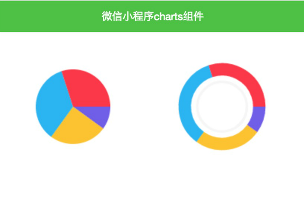
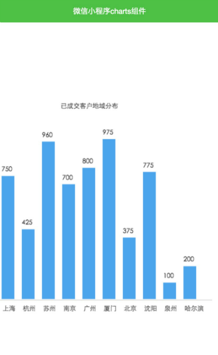
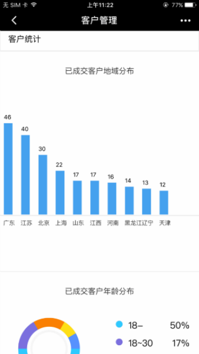

# wxapp-charts

微信小程序图表charts组件


### Usage

```JavaScript
        data: {
                charts: {
                    area: ["上海,750","杭州,425","苏州,960","南京,700","广州,800","厦门,975","北京,375","沈阳,775","泉州,100","哈尔滨,200"],
                    pieData: [10, 25, 35, 30]
                }
            }

            //饼图    
        new Charts({
            type: "pie",
            data: this.data.charts.pieData,
            colors: ["#7158ec", "#fec312", "#1db2f4", "#ff3444"],
            canvasId: 'canvas1',
            point: {
                x: 150,
                y: 150
            },
            radius : 100
        });
        //圆环图
        new Charts({
            type: "ring",
            data: [10, 25, 35, 30],
            colors: ["#7158ec", "#fec312", "#1db2f4", "#ff3444"],
            canvasId: 'canvas2',
            point: {
                x: 150,
                y: 150
            },
            radius : 100
        });

        //柱状图
        new Charts({
            type: 'bar',
            data: this.data.charts.area,
            bgColors: "#46a2ef",
            color: '#383838',
            cHeight: 300,//表格高度
            cWidth: 500,//表格宽度
            bWidth: 22,//柱子宽度
            bMargin: 16,//柱子间距
            showYAxis: false,//是否显示Y轴
            xCaption: 'x轴说明文字',
            yCaption: 'y轴说明文字',
            canvasId: 'chartContainer'
         });
```


### 参数说明

```
    type: -支持pie,ring,bar
    data: []
    colors： []颜色
    canvasId: canvas-id
    point:x轴圆心坐标,y轴圆心坐标
    radius：半径大小
    xCaption: 水平坐标说明文字
    yCaption： 纵坐标说明文字
    showYAxis：是否显示y轴
```

### 更新说明

- 增加data对外接口
- 添加部分API，如cWidth等

### 效果如图所示





>手机端效果




